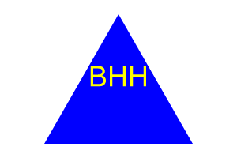

# Shapes-Letters-NPM-oh-my

 

## Description

Text Editor that can be used on and offline and console logs information that is input. It utilizes db, Webpack, PWA and is locally cached. The app is deployed on Heroku at: https://benetheapwatexteditor-ceb32b8b6a4e.herokuapp.com/
Github Repo: https://github.com/Neta2393/PWA-TextEditor


## Table of Contents:
  * [User-Story](#user-story)
  * [Acceptance Criteria](#acceptance-criteria)
  * [Installation](#installation)
  * [Screenshots](#screenshots)
  * [Tests](#tests)
  * [Contribute](#contribute)
  * [GitHub](#github)

## User Story

```md
AS a freelance web developer
I WANT to generate a simple logo for my projects
SO THAT I don't have to pay a graphic designer
```

## Acceptance Criteria

```md
GIVEN a command-line application that accepts user input
WHEN I am prompted for text
THEN I can enter up to three characters
WHEN I am prompted for the text color
THEN I can enter a color keyword (OR a hexadecimal number)
WHEN I am prompted for a shape
THEN I am presented with a list of shapes to choose from: circle, triangle, and square
WHEN I am prompted for the shape's color
THEN I can enter a color keyword (OR a hexadecimal number)
WHEN I have entered input for all the prompts
THEN an SVG file is created named `logo.svg`
AND the output text "Generated logo.svg" is printed in the command line
WHEN I open the `logo.svg` file in a browser
THEN I am shown a 300x200 pixel image that matches the criteria I entered
```
## Installation

To install clone the repo at https://github.com/Neta2393/Shapes-Letters-NPM-oh-my


## Screenshots





## Tests
node index.js


## Contribute
to contribute please contact benetheahardin@yahoo.com

## Github
This repo and others can be found at https://github.com/Neta2393